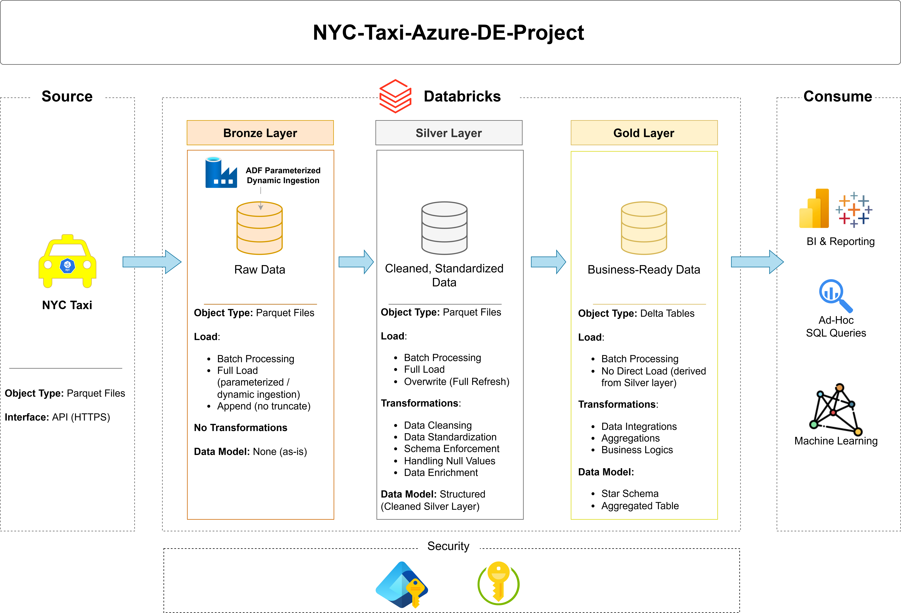

# 🚖 NYC Taxi Data Engineering Pipeline (Azure | ADF | Databricks)

## 📌 Overview

This project implements an end-to-end, production-style data engineering pipeline on Azure using the NYC Taxi dataset. The solution is built using a **Medallion Architecture (Bronze, Silver, Gold)** to enable scalable, maintainable, and analytics-ready data processing.

The pipeline ingests data from external sources, processes it using distributed compute in Databricks, and delivers curated datasets for business intelligence and advanced analytics.

---

## 🏗️ Architecture

---

## 🔄 End-to-End Data Flow

**Source → ADF Ingestion → Bronze → Databricks Transformation → Silver → Gold → Consumption**

---

## 🔹 Data Source

* Dataset: NYC Taxi Data
* Format: Parquet Files
* Access Method: HTTPS

---

## 🥉 Bronze Layer – Raw Data Ingestion

### Tool: Azure Data Factory (ADF)

A dynamic and parameterized ingestion pipeline is implemented to fetch data from external sources.

### Key Features:

* Parameterized pipelines for flexible ingestion (e.g., dataset type, dates)
* Scalable design to support multiple datasets
* Automated ingestion using ADF activities

### Details:

* Object Type: Parquet Files
* Load Type: Batch Processing
* Load Strategy: Full Load (parameter-driven ingestion)
* Write Mode: Append (no data loss)
* Transformations: None
* Storage: Azure Data Lake Gen2

### Purpose:

* Preserve raw data in its original format
* Enable reprocessing and auditing

---

## 🥈 Silver Layer – Data Transformation

### Tool: Azure Databricks (PySpark)

Raw data from Bronze is processed and transformed into a clean, structured format.

### Transformations Applied:

* Data cleansing and validation
* Schema enforcement
* Handling missing/null values
* Deduplication
* Data standardization
* Derived column creation
* Data enrichment

### Details:

* Object Type: Parquet Files
* Load Type: Batch Processing
* Load Strategy: Full Load
* Write Mode: Overwrite (full refresh)
* Data Model: Structured (cleaned datasets)

### Purpose:

* Improve data quality
* Create consistent and usable datasets

---

## 🥇 Gold Layer – Business & Analytics Layer

### Tool: Databricks (SQL / PySpark)

The Gold layer transforms Silver data into business-ready datasets optimized for analytics.

### Transformations Applied:

* Data integration across multiple datasets
* Aggregations (e.g., trip counts, revenue metrics)
* Business logic implementation
* KPI calculations

### Data Modeling:

* Star Schema (Fact & Dimension tables)
* Aggregated tables for reporting
* Denormalized datasets for performance

### Details:

* Object Type: Delta Tables
* Load Type: Batch Processing
* Load Strategy: Derived from Silver (no direct ingestion)

### Purpose:

* Enable fast querying and analytics
* Serve as the source for BI tools and reporting

---

## 📊 Data Consumption

The Gold layer supports:

* 📈 Business Intelligence & Dashboards
* 🔍 Ad-hoc SQL Queries
* 🤖 Machine Learning use cases

---

## ⚙️ Technologies Used

* Azure Data Factory (ADF)
* Azure Data Lake Storage Gen2
* Azure Databricks
* PySpark
* Parquet
* Delta Lake

---

## 🔐 Security & Authentication

Secure access to Azure resources is implemented using a **Service Principal configured via Microsoft Entra ID (Azure Active Directory)**.

### Implementation Steps:

1. **Service Principal Creation**

   * Created an application in **Microsoft Entra ID (App Registrations)**
   * Generated a **Client ID** and **Tenant ID**

2. **Client Secret Configuration**

   * Created a **Client Secret** within the App Registration
   * Used the secret for authentication in Databricks

3. **Access Control (IAM) Setup**

   * Assigned the Service Principal the role:

     * **Storage Blob Data Contributor**
   * Role applied at Azure Data Lake Storage Gen2 level using **IAM (Access Control)**

4. **Databricks Integration**

   * Configured secure access to Data Lake using:

     * Service Principal (Client ID + Secret)
     * ABFSS protocol for secure data access

### Security Best Practices:

* Credentials are not exposed in production workflows
* Recommended to store secrets using:

  * Databricks Secret Scope
  * Azure Key Vault

> This setup ensures secure, role-based access to storage and enables seamless integration between Azure services.

---

## 🚀 Key Highlights

* Dynamic, parameter-driven ingestion pipelines in ADF
* End-to-end pipeline from raw ingestion to business-ready data
* Implementation of Medallion Architecture
* Scalable and modular design
* Separation of concerns across data layers
* Secure authentication using Service Principal

---

## 📈 Future Enhancements

* Implement incremental (delta) loading instead of full load
* Extend Delta Lake to Silver layer
* Add orchestration triggers and monitoring in ADF
* Integrate Power BI dashboards
* Implement CI/CD for pipeline deployment

---

## 💬 Conclusion

This project demonstrates how to design and implement a scalable, secure, and production-ready data engineering pipeline on Azure. It highlights best practices in data ingestion, transformation, modeling, and security.

---

## 👨‍💻 Author

Mayur Swami
